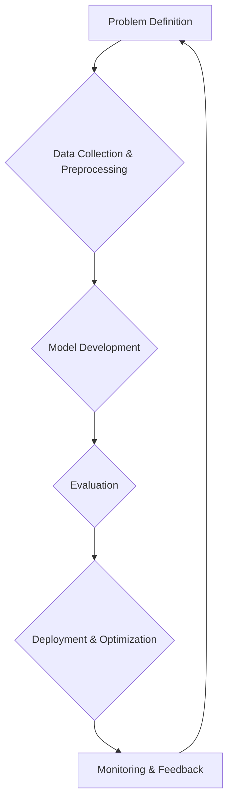

# Part 4: Reflection & Workflow Diagram

## Reflection

*   **Challenges Faced:**
    *   **Data Imbalance:** Both datasets likely suffer from class imbalance (e.g., fewer student dropouts, fewer hospital readmissions), which significantly impacts model performance, especially recall for the minority class, as observed in the hospital readmission model (recall of 0.01 for readmitted patients). This requires careful consideration of evaluation metrics beyond simple accuracy and the implementation of specific techniques like oversampling or cost-sensitive learning.
    *   **Feature Engineering:** The raw datasets often lack features that directly capture complex behavioral or clinical nuances. Effective feature engineering, requiring domain expertise, is crucial but challenging.
    *   **Model Interpretability vs. Performance:** Balancing the need for highly accurate models with the desire for interpretable models (especially in sensitive domains like healthcare and education) is a constant trade-off.
*   **Learnings:**
    *   **Importance of Data Understanding:** Thorough exploratory data analysis (EDA) is paramount to understanding data types, distributions, missing values, and potential biases before any modeling begins.
    *   **Structured Workflow:** Implementing a structured AI development workflow, from problem definition to deployment considerations, ensures a systematic and reproducible approach.
    *   **Iterative Refinement:** Model development is an iterative process. Initial models often serve as baselines, requiring continuous refinement, hyperparameter tuning, and potentially different algorithms to achieve desired performance.
    *   **Ethical Considerations:** The assignment highlighted the critical importance of considering ethical implications, potential biases, and trade-offs throughout the AI lifecycle, especially when models impact individuals' lives.
*   **Future Improvements:**
    *   **Advanced Preprocessing:** Explore more sophisticated imputation techniques, outlier handling, and feature engineering based on domain knowledge.
    *   **Hyperparameter Optimization:** Implement systematic hyperparameter tuning using techniques like GridSearchCV or RandomizedSearchCV to find optimal model configurations.
    *   **Addressing Imbalance:** Experiment with advanced techniques for imbalanced datasets, such as SMOTE, ADASYN, or ensemble methods specifically designed for imbalance (e.g., BalancedRandomForestClassifier).
    *   **Model Comparison:** Evaluate and compare multiple machine learning algorithms (e.g., Gradient Boosting, SVMs, Neural Networks) to identify the best-performing model for each problem.
    *   **Explainable AI (XAI):** Integrate XAI tools (e.g., SHAP, LIME) to provide insights into model predictions, enhancing transparency and trust, particularly in the hospital readmission context where clinical decisions are critical.

## AI Development Workflow Diagram

This diagram visually represents the end-to-end process followed in AI development, from problem definition to model evaluation and deployment considerations.

